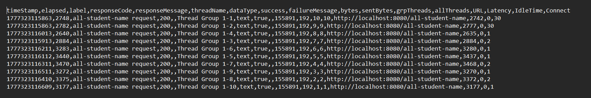
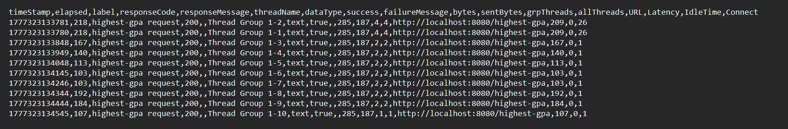

## Kesimpulan
Kinerja pada load testing menggunakan JMeter menunjukkan peningkatan, khususnya pada nilai sample time setelah dilakukan optimasi performa. Hal ini menunjukkan bahwa JMeter dapat dimanfaatkan sebagai alat ukur untuk menilai seberapa baik performa aplikasi yang dikembangkan. 
Jika hasil metrik dari JMeter masih lebih lambat dari yang diharapkan, maka kemungkinan masih terdapat bagian kode yang tidak efisien. Dalam konteks modul ini, ditemukan adanya pemanggilan service yang berlebihan dan redundan. Temuan ini menegaskan bahwa inefisiensi kecil pada level kode dapat memberikan dampak signifikan ketika sistem menangani banyak pengguna secara bersamaan.

## Refleksi
1. JMeter digunakan untuk performance testing dari sisi eksternal (black-box), dengan mensimulasikan banyak user dan mengukur respons sistem seperti throughput, response time, dan error rate. Sementara itu, IntelliJ Profiler bekerja dari sisi internal (white-box), menganalisis eksekusi kode seperti penggunaan CPU, memory, dan method mana yang paling berat.
2. Dengan memberikan insight detail seperti method yang paling sering dipanggil, durasi eksekusi, serta penggunaan resource sehingga kita bisa menemukan bottleneck, misalnya fungsi yang terlalu lama dieksekusi atau penggunaan memory yang berlebihan.
3. Ya karena profiler membantu mengidentifikasi bottleneck secara spesifik di level kode, sehingga kita tidak hanya tahu ada masalah, tapi juga tahu letak dan penyebabnya.
4. Tantangan terbesar yang saya hadapi adalah memahami hasil profiling, terutama saat membaca flame graph dan call tree. 
Visualisasi tersebut tidak hanya menampilkan method dari kode yang saya tulis, tetapi juga dari library eksternal, sehingga diperlukan ketelitian untuk membedakan mana yang benar-benar menjadi bottleneck pada kode sendiri dan mana yang merupakan perilaku normal dari library. 
Untuk mengatasinya, saya melakukan analisis secara bertahap sambil mengaitkan hasil profiling tersebut langsung dengan bagian kode yang relevan.
5. Profiler memberikan manfaat dalam proses analisis performa aplikasi, terutama dalam mengidentifikasi bottleneck secara lebih detail di level kode. Selain itu, profiler membantu dalam memantau penggunaan CPU dan memori, sehingga saya dapat mengetahui bagian mana yang paling membebani sistem.
6. Mencari tahu di mana masalah tersebut terjadi dengan JMeter, kemudian menggunakan profiler untuk mencari tahu kenapa masalah tersebut terjadi. 
Setelah itu saya akan memeastikan bahwa environment seperti data,konfigurasu, dan cache konsisten.
Terakhir, saya akan mencari skenario yang terbukti lambat saat diuji di JMeter, lalu menjalankannya ulang secara terkontrol di environment profiling supaya bisa dianalisis lebih dalam di level kode.
7. Setelah saya menganalisis hasil profiling dan load testing, strategi yang saya terapkan adalah mengembalikan logika pemrosesan yang seharusnya ditangani oleh database ke sisi database, seperti mengganti proses filtering di Java menjadi query langsung pada DB, serta menghindari pembuatan objek yang tidak perlu atau redundan.
Sedangkan untuk memastikan bahwa perubahan tersebut tidak mengubah fungsionalitas aplikasi, saya melakukan pengujian ulang dengan menjalankan aplikasi dan memverifikasi hasilnya secara manual.

## JMeter
### all-student-name
.png)
.png)
.png)
.png)

### highest-gpa
.png)
.png)
.png)
.png)

## CLI

